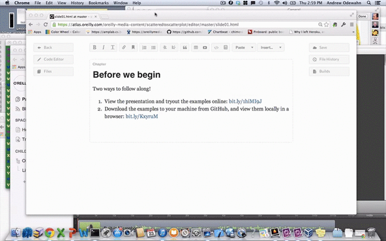

# Atlas is...

* A tool for creating and publishing rich technical information

# Based on 3 key ideas
* Version control through [git](http://git-scm.com/)
* Semantic markup
** [HTMLBook](https://github.com/oreillymedia/htmlbook)
** [AsciiDoc](http://www.methods.co.nz/asciidoc/)
** [DocBook](http://www.docbook.org/)
** [MarkDown](http://daringfireball.net/projects/markdown/)
* Transformation engines
** PDF
** EPUB 
** Mobi
** HTML

# Add an Image

* Open the file pane
* Find the image
* Drag it over 

# Another slide

Here's another slide!

