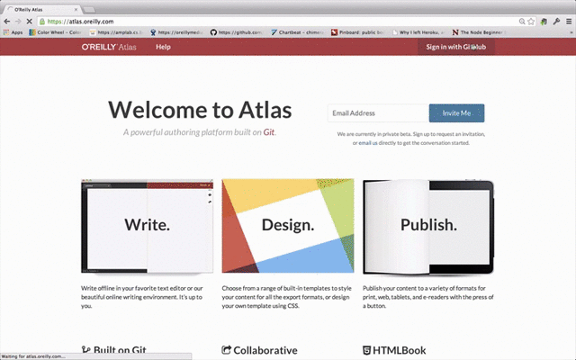

# Atlas is...

A tool for creating and publishing beautiful technical content

# Atlas embodies 3 key ideas
* Version control using [git](http://git-scm.com/)
* A single source of content in a semantic format
  * [HTMLBook](https://github.com/oreillymedia/htmlbook)
  * [AsciiDoc](http://www.methods.co.nz/asciidoc/)
  * [DocBook](http://www.docbook.org/)
  * [MarkDown](http://daringfireball.net/projects/markdown/)
* Transformation engines based on a customizable theme
  * PDF
  * EPUB 
  * Mobi
  * HTML

# Make books

# Make ebooks

# Make sites

# Write with a truly visual editor

If you don't like plain text markup, Atlas has a beautiful visual editor.

# Open source your book on GitHub

# Register for the beta

(I'll embed the mailchimp form here)
